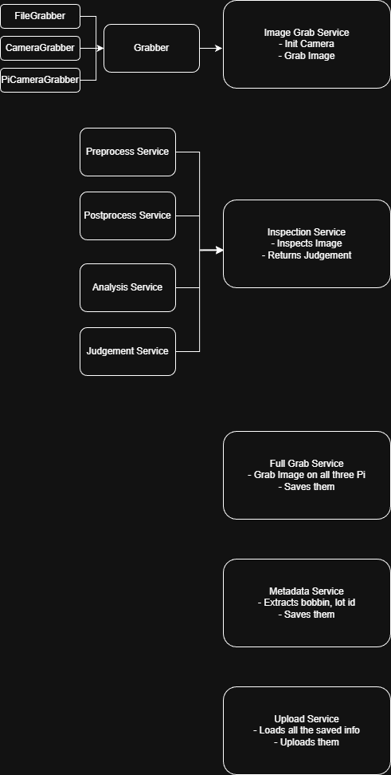

# Unloader Project

- Python Open CV based project to detect roller on the unloader
- Inspection is designed to work on any system. 
    - (Might have to tweak what gets passed into inspection service)
- Work in progress
---

# Service Overview
- Service below are created to be independent and flexible
- 

# Project flow
### 2 Threads
1. Start up UI view in the main thread
2. Runner thread runs which will do roller detection, send signal to other system and upload etc
    - Runner will call update method to update UI view
    
### Runner Sequence
1. Grab Image every configured seconds
2. Detect if there is roller or not
3. If there is, it will detect roller is close or not
4. If roller is in the position, save those images and make other pi slaves to do so too
5. Upload these photos to mini PC
6. If everything was sucessful, wait configured minutes before doing runner sequence again

## Requirements
- python version specified in .python-version
- uv
- picamera2
---

## Project Enviornment Setup (Rasberry PI)
```bash
# Step 1 : Installing Picamera-Python 
sudo apt update
sudo apt install -y python3-picamera2

# Step 2 : Installing UV for dependency management
pip install uv

# Step 3 : This step will import and install all necessary modules
uv sync
```

## To Run the project
```bash
# To grab with file
uv python -m main -file
# To grab with camera (regular usb camera)
uv python -m main -camera
# To grab with picamera (for rasberry pi)
uv python -m main -picamera
```

